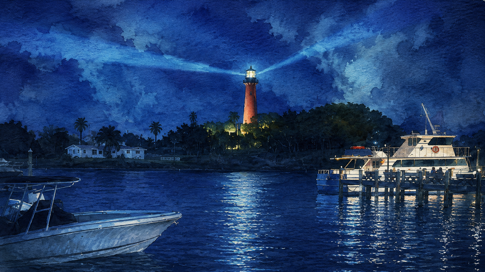
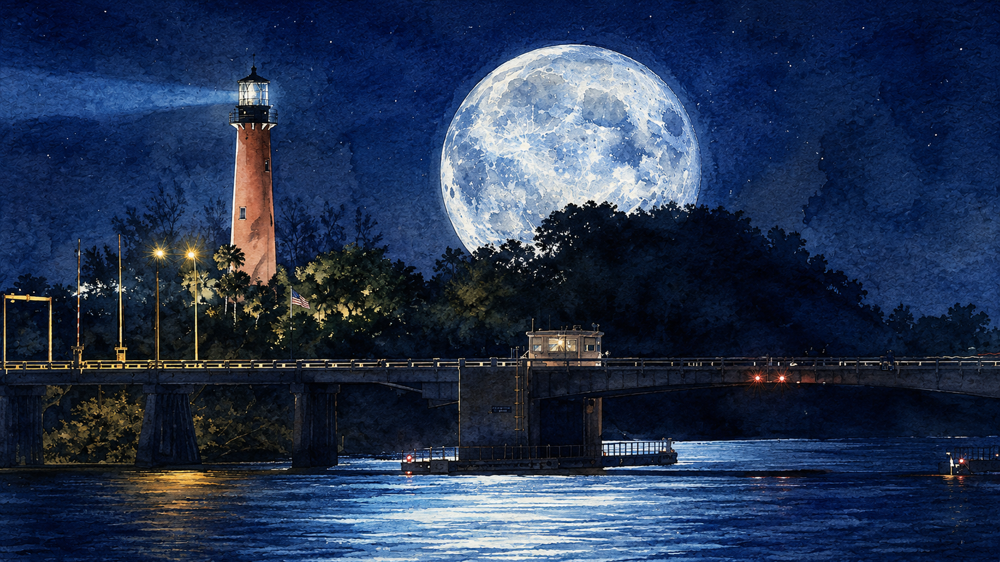
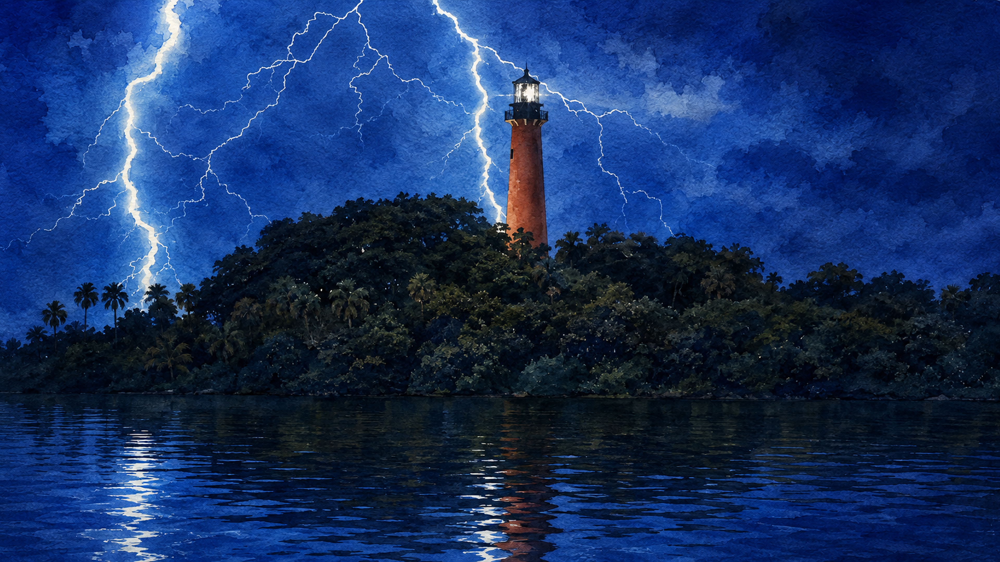
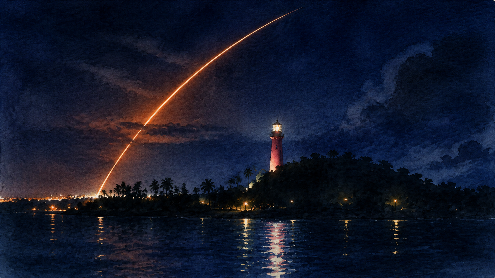
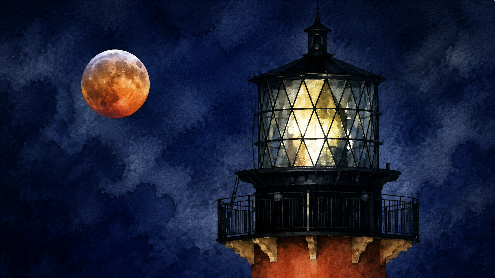
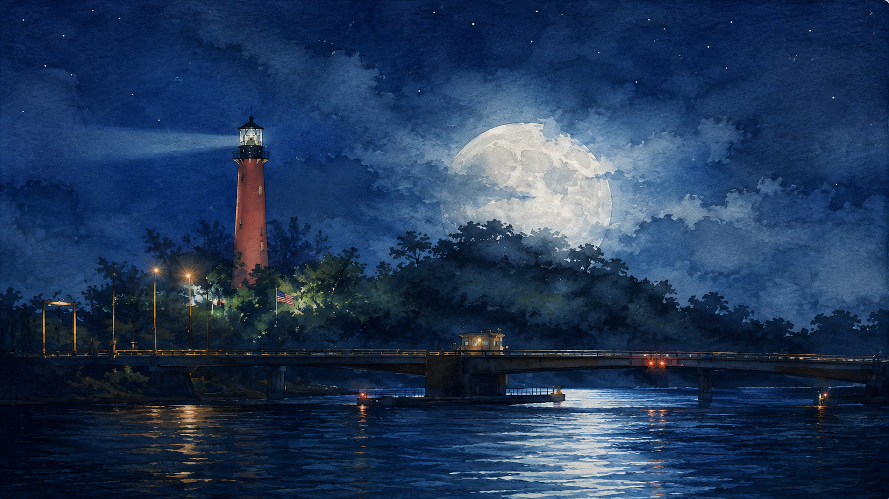
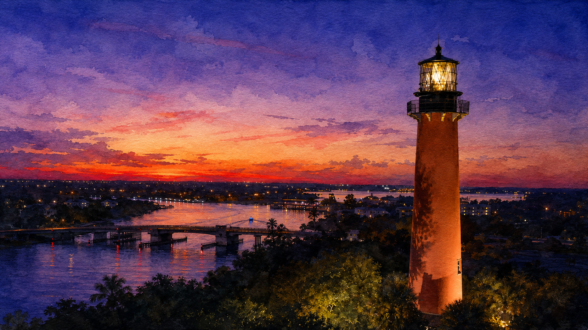

# Jupiter Lighthouse Dark

A nocturnal coastal theme for [Omarchy](https://omarchy.org), built around seven original watercolor views of the Jupiter Inlet Lighthouse.

The palette pairs deep Atlantic navy surfaces with aged ivory text, moonlit blue and cyan utility colors, and the lighthouse's coral masonry as the primary accent. It uses Yaru's `prussiangreen` icon variant.

Companion theme: [Jupiter Lighthouse Light](https://github.com/rblalock/omarchy-jupiter-lighthouse-light-theme)

## Install

```bash
omarchy theme install https://github.com/rblalock/omarchy-jupiter-lighthouse-dark-theme
```

Then choose **Jupiter Lighthouse Dark** from Omarchy's theme menu. Use the background menu to move between the seven included 4K wallpapers.

## Wallpapers

<table>
  <tr>
    <td align="center">
      <br>
      <sub>Marina Beacon</sub>
    </td>
    <td align="center">
      <br>
      <sub>Moonrise Bridge</sub>
    </td>
  </tr>
  <tr>
    <td align="center">
      <br>
      <sub>Storm Lightning</sub>
    </td>
    <td align="center">
      <br>
      <sub>Rocket Trail</sub>
    </td>
  </tr>
  <tr>
    <td align="center">
      <br>
      <sub>Copper Moon Lantern</sub>
    </td>
    <td align="center">
      <br>
      <sub>Veiled Moon Bridge</sub>
    </td>
  </tr>
  <tr>
    <td align="center" colspan="2">
      <br>
      <sub>Sunset Aerial</sub>
    </td>
  </tr>
</table>

All wallpapers are 3840 x 2160 PNGs.
